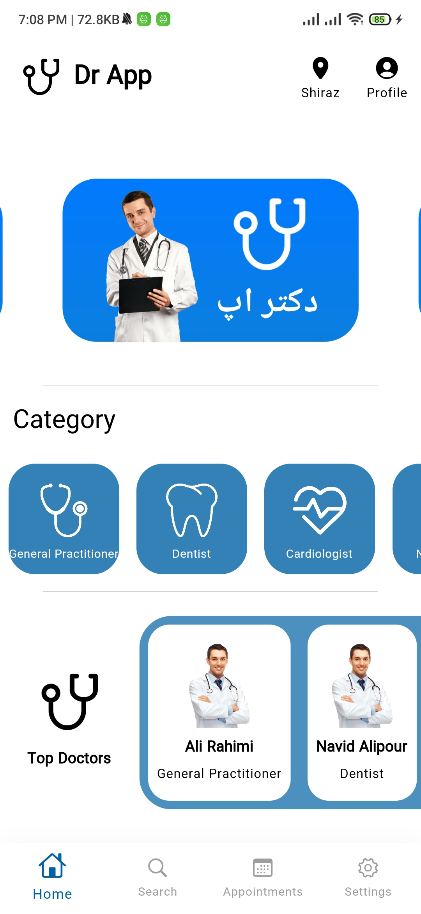

# **Dr App**  

[

## 💻 Requirements

- Any Operating System (ie. MacOS X, Linux, Windows)
- Any IDE with Flutter SDK installed (ie. IntelliJ, Android Studio, VSCode etc)
- A knowledge of Dart and Flutter

## ✨ Features

- [x] Language English & Farsi.
- [x] Save Doctors.
- [x] Dark Mode
- [x] Material Design 3.

## 📸 ScreenShots

<!--  -->

| Light                             | Dark                              |
| --------------------------------- | --------------------------------- |
|   |   |
|   |   |
|   |   |
|   |   |

## 🔌 Plugins

| Name                                                                   | Usage                                         |
| ---------------------------------------------------------------------- | --------------------------------------------- |
| [**GetX**](https://pub.dev/packages/get)                               | State Management                              |
| [**GetX Storage**](https://pub.dev/packages/get_storage)                    | Local Storage                                 |

 # <em>Version : 0.7 Beta<em/> 

