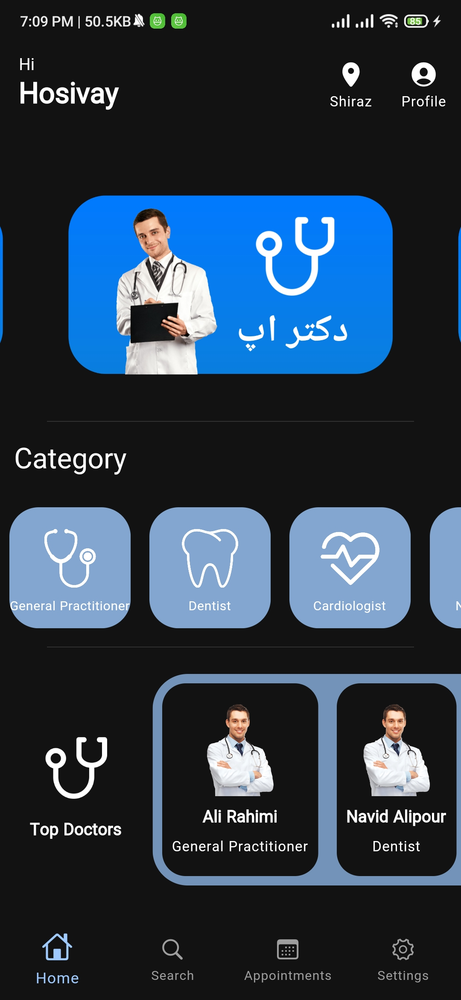

# **Dr App**  

## ✨ Features

- [x] Language English & Farsi
- [x] Dark Mode
- [x] Material Design 3

## 📸 ScreenShots

| Light                             | Dark                              |
| --------------------------------- | --------------------------------- |
|   |   |
|   |   |
|   |   |
|   |   |

## 🔌 Plugins

| Name                                                                   | Usage                                         |
| ---------------------------------------------------------------------- | --------------------------------------------- |
| [**GetX**](https://pub.dev/packages/get)                               | State Management                              |
| [**GetX Storage**](https://pub.dev/packages/get_storage)               | Local Storage                                 |

 # <em>Version : 0.7 Beta<em/> 

